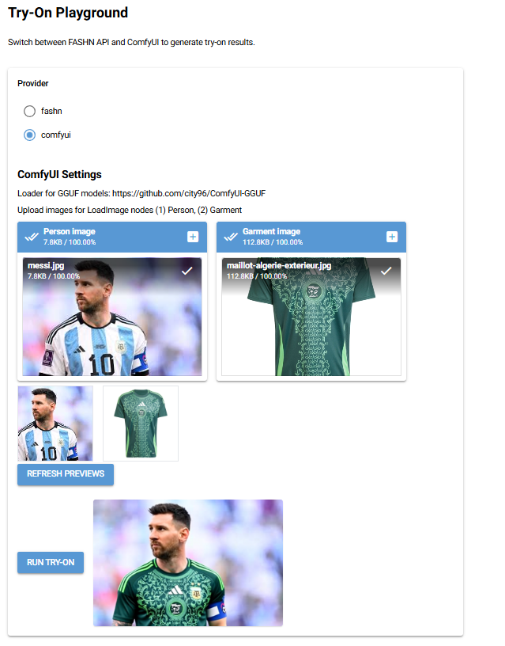

<h1>Fashion App</h1>


[](https://www.python.org/downloads/release/python-3120/)
[](https://www.debian.org/)
[](#)

[](#)
[](https://pytorch.org/get-started/locally/)
[](#)


[](#)

[](https://github.com/charliermarsh/ruff)
[](#)
[]()
[](#)
[](#)

# Example

| Person                                                        | Garment                                                                            | Result                                                         |
|---------------------------------------------------------------|------------------------------------------------------------------------------------|----------------------------------------------------------------|
|  |  |  |

# Try-On App

## Overview

The Try-On App is an innovative application designed to allow users to virtually try on products (such as clothing, accessories, or similar items) using their device. By leveraging advanced technologies such as image processing and possibly machine learning, the app provides a seamless and interactive experience for users to preview how items would look on them before making a purchase or decision.

## Features

- Virtual try-on experience for various products
- User-friendly interface for uploading photos or using live camera
- Realistic overlay and fitting of items on user images
- Support for multiple item categories
- Option to save, share, or download try-on results
- Responsive design for use on desktop and mobile devices

## Project Structure and Technologies

- **Frontend:**
  Built with **React** (see `frontend/`). This is the user-facing web application.

- **API:**
  The backend API is built with **FastAPI** (see `api/`). This serves as the main backend for the app, handling authentication, business logic, and data.

- **Backend (ML/AI):**
  The backend will also implement and serve **machine learning models** (e.g., for generative AI, embeddings, etc.), either locally or via cloud providers.

---

## Environment Variables

### Frontend

The frontend expects the following environment variables (typically in `frontend/.env.dev` or similar):

- `REACT_APP_BACK_API_URL`
  The base URL for the backend API (e.g., `http://localhost:8000`).

- `REACT_APP_STRIPE_PUBLISHABLE_KEY`
  The Stripe publishable key for payment integration.

You may need to add more depending on your deployment (e.g., analytics, Sentry, etc.).

### API

The API backend (in `api/`) expects the following environment variables (see `docker-compose.dev.yml`, `api/main.py`, and `api/routes.py`):

- `BACKEND_HOST` (default: `0.0.0.0`)
  - Host for the FastAPI server.
- `BACKEND_PORT` (default: `8000`)
  - Port for the FastAPI server.
- `FAST_API_SECRET_KEY`
  - Secret key for JWT authentication.
- `SECRET_KEY`
  - Secret key for other cryptographic operations (used in routes).
- `STRIPE_SECRET_KEY`
  - Stripe secret key for payment processing.
- `STRIPE_WEBHOOK_SECRET`
  - Stripe webhook secret for validating Stripe webhooks.
- `FRONT_END_URL`
  - The URL of the frontend app (used for CORS and redirects).

### Backend (ML models)

The backend expects the following environment variables (see `docker-compose.dev.yml` and backend code):

- `BACKEND_HOST` (default: `0.0.0.0`)
  Host for the FastAPI server.
- `BACKEND_PORT` (default: `8000`)
  Port for the FastAPI server.
- `OLLAMA_MODEL_NAME`
  Name of the LLM model to use with Ollama.
- `OLLAMA_EMBEDDING_MODEL_NAME`
  Name of the embedding model to use with Ollama.
- `INFERENCE_DEPLOYMENT_NAME`
  Name of the inference deployment.
- `INFERENCE_BASE_URL`
  Base URL for inference API (e.g., `http://ollama:11434`).
- `INFERENCE_API_KEY`
  API key for inference service.
- `EMBEDDINGS_DEPLOYMENT_NAME`
  Name of the embeddings deployment.
- `EMBEDDINGS_BASE_URL`
  Base URL for embeddings API.
- `EMBEDDINGS_API_KEY`
  API key for embeddings service.
- `UV_PROJECT_ENVIRONMENT`
  Path to the backend virtual environment.
- `PYTHONUNBUFFERED`
  Set to `1` to ensure Python output is not buffered (useful for logging in Docker).

You may also need to set up database URLs, secret keys, and other service credentials as required by your deployment.

---

## Try-On API (Virtual Try-On)

This repository includes a dedicated virtual try-on backend and a simple UI playground under `tryon-api/`.

### UI Preview



### Features

- Two providers selectable at runtime:
  - `comfyui`: Local try-on via a ComfyUI workflow (our packaged API workflow in `tryon_api/ai/tryon_workflow.py`).
  - `fashn`: Cloud-based try-on via the FASHN API (see: [Try-On Python Quickstart](https://docs.fashn.ai/guides/tryon-python-quickstart-guide)).
  - Standalone NiceGUI playground to submit jobs and preview results.
  - Async polling and detailed logging.

### Project layout

- API app (FastAPI): `tryon-api/src/tryon_api/app.py`
- Routes: `tryon-api/src/tryon_api/api/routes/tryon.py`
- Providers:
  - ComfyUI client: `tryon-api/src/tryon_api/ai/comfyui_client.py`
  - FASHN client: `tryon-api/src/tryon_api/ai/fashn_client.py`
- Standalone UI (NiceGUI): `tryon-api/src/tryon_api/ui.py`
- Settings: `tryon-api/src/tryon_api/env_settings.py`

### Environment variables

Add the following to your root `.env` (see `.env.example`):

- API/Server
  - `BACKEND_HOST` (default `127.0.0.1`)
  - `BACKEND_PORT` (default `8001`)
  - `DEV_MODE` (default `True` to enable verbose logging)

- ComfyUI provider
  - `COMFYUI_SERVER_URL` (e.g. `http://127.0.0.1:8000`)
  - Requires ComfyUI to be running and reachable at `COMFYUI_SERVER_URL`. Requires the models to be downloaded and available.

- FASHN provider
  - `FASHN_API_KEY` (required to use provider `fashn`)
  - Optional: `FASHN_MODEL_NAME` (default `tryon-v1.6`), `FASHN_BASE_URL`, `FASHN_POLL_INTERVAL`, `FASHN_TIMEOUT_SECONDS`


- Standalone UI (NiceGUI)
  - `UI_HOST` (default `127.0.0.1`)
  - `UI_PORT` (default `8080`)

### Running locally

Install workspace dependencies once from repo root:

```bash
make install-dev
```

Run the try-on API (FastAPI):

```bash
make tryon-api-start
```

Run the standalone UI (NiceGUI):

```bash
make tryon-ui-start
```

Defaults:

- API: `http://127.0.0.1:8001/api`
- API docs: `http://127.0.0.1:8001/docs`
- UI: `http://127.0.0.1:8080`

### Using providers

- FASHN
  - Set `FASHN_API_KEY`.
  - In the UI, choose provider `fashn`, enter the `model_image` and `garment_image` URLs and, optionally, JSON `inputs`.
  - The backend will submit to `/run` and poll `/status/<id>` to return final image URLs.

- ComfyUI
  - Ensure ComfyUI is running and reachable at `COMFYUI_SERVER_URL`.
  - In the UI, choose provider `comfyui`, upload a person image and a garment image.
  - The backend uploads images to ComfyUI/input and forces the workflow’s LoadImage nodes to use those filenames, then verifies wiring before execution.

### If you are using WSL

If the API runs in WSL and ComfyUI runs on Windows:

- `127.0.0.1` in WSL is not the Windows host.
- Use the Windows host IP (from `ipconfig`) and ensure ComfyUI server (in settings) is set to `0.0.0.0` and not `127.0.0.1`.
- Example: `COMFYUI_SERVER_URL=http://<WINDOWS_IP>:8000`
- Test from WSL: `curl -I http://<WINDOWS_IP>:8000`


### 1.3 ⚙️ Steps for Installation (Contributors and maintainers)
Check the [CONTRIBUTING.md](CONTRIBUTING.md) file for more information.

## 2. Contributing
Check the [CONTRIBUTING.md](CONTRIBUTING.md) file for more information.
